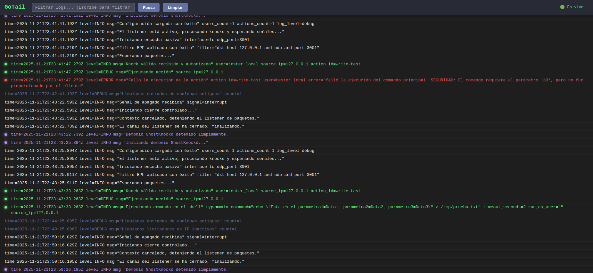

# GoTail

Herramienta simple en Go para visualizar archivos de log en tiempo real a través de un navegador web. Utiliza WebSockets para el streaming y permite colorear líneas basándose en palabras clave o expresiones regulares definidas en archivos JSON.



## 🚀 Características

- Lectura de archivos en tiempo real (`tail -f`).
- Interfaz web simple con scroll automático y pausa.
- Resaltado de sintaxis configurable (colores y marcadores).
- Soporte para expresiones regulares (Regex).
- Perfiles de configuración intercambiables (syslog, auth, apache, etc.).

## 📥 Descarga e Instalación

Necesitas tener **Go** instalado.

```bash
# Clonar el repositorio
git clone https://github.com/soyunomas/gotail.git

# Entrar al directorio
cd gotail

# Descargar dependencias
go mod tidy
```

## ⚙️ Ejecución

Puedes ejecutarlo directamente o compilarlo.

### Ejecución directa
```bash
go run main.go -file /var/log/syslog -profile syslog
```

### Compilación (Binario)
Genere un ejecutable para usarlo sin depender del código fuente:

```bash
# Compilar
go build -o gotail main.go

# Ejecutar el binario
./gotail -file /var/log/auth.log -profile auth -port 8080
```

### Parámetros
- `-file`: Ruta al archivo de log (Obligatorio).
- `-profile`: Nombre del archivo JSON en la carpeta `configs/` (sin extensión). Por defecto usa `default`.
- `-port`: Puerto del servidor web (Por defecto `9000`).

## 🛠️ Configuración

Los perfiles se encuentran en la carpeta `configs/`. Puedes crear los tuyos propios siguiendo este formato JSON:

```json
[
  {
    "keyword": "error|fail", 
    "color": "#ff5555", 
    "dot": "red", 
    "use_regex": true 
  },
  {
    "keyword": "Connection accepted", 
    "color": "#50fa7b", 
    "dot": "green", 
    "use_regex": false 
  }
]
```

## 📂 Estructura

```text
/GoTail
│
├── main.go            # Lógica del servidor
├── index.html         # Interfaz web (embebido)
├── screenshot.png     # Captura de pantalla
├── configs/           # Perfiles de configuración
│   ├── default.json
│   ├── auth.json
│   ├── syslog.json
│   └── ...
└── LICENSE            # Licencia MIT
```

## ⚖️ Licencia

Este proyecto está bajo la licencia **MIT**. Consulta el archivo `LICENSE` para más detalles.
